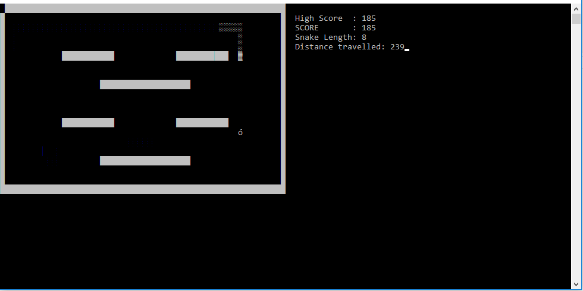

# Snake

My first game, written in C language.
There are 7 different levels. Player can directly select any level he wants to play. Higher levels are more difficult.

Player can move the snake using arrow keys or 'w','a','s','d'.
Food pills appear randomly in the play area. When the snake eat the food pill, its length increases and also your score.

